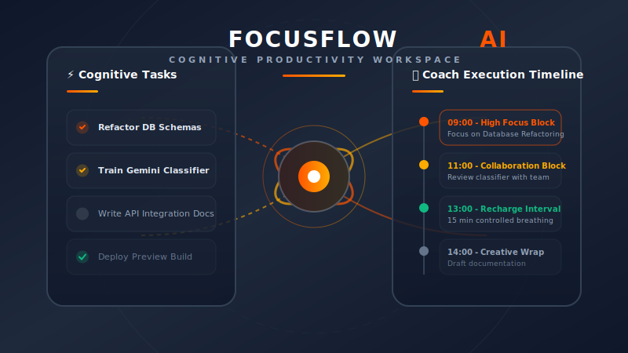

# FocusFlow AI — Premium Cognitive Productivity Workspace

<p align="center">
  
</p>

---

## 🌟 Introduction

**FocusFlow AI** is a production-grade, highly optimized cognitive productivity workspace designed to transform standard, chaotic daily scheduling into a highly structured, focused, and recovered flow state. Guided by **Google Gemini AI**, FocusFlow AI acts as an intelligent productivity companion—monitoring schedule friction, prioritizing heavy task backlogs, breaking down complex engineering tasks into digestible sub-steps, and scheduling active "recharge intervals" with deep breathing cycles to prevent burnout.

The application features a gorgeous **Neumorphic Light UI** styled around soft shadows, spacious layouts, fluid typography, and micro-interactions, designed to induce a calm, focused working state.

---

## 🏗️ Architecture Blueprint

FocusFlow AI is designed as a modular, full-stack application built for horizontal scaling and secure containment:

```
                      +-----------------------------+
                      |      FocusFlow Frontend     |
                      |   (React 18 + Vite + TS)    |
                      +--------------+--------------+
                                     |
                                     |  HTTP REST / JSON
                                     v
                      +-----------------------------+
                      |      FocusFlow Backend      |
                      |  (Spring Boot 3 + Java 17)  |
                      +-------+--------------+------+
                              |              |
                JPA / SQL     |              |  HTTPS / Google GenAI SDK
                              v              v
         +--------------------+----+    +----+----------------------+
         |     MySQL Database      |    |      Google Gemini API     |
         |    (Local / Cloud SQL)  |    |     (gemini-2.5-flash)     |
         +-------------------------+    +---------------------------+
```

### Key Architectural Standards Met:
- **Dual-Mode Data Engine**: Features a decoupled data provider system (`IDataProvider`) allowing the frontend to run either in **VITE_PREVIEW_MODE (Offline Sandbox)** using high-fidelity simulated localStorage engines, or **Connected Production Mode** talking directly to the Spring Boot REST API.
- **Micro-State Execution**: Uses standard JPA entities with transaction isolation, managed connection pooling (HikariCP), and centralized Spring MVC custom Exception handlers (`GlobalExceptionHandler`).
- **Security Isolation**: Incorporates strict stateless JWT Authentication, CORS dynamic domain restrictions, and an automated startup validator (`StartupValidator`) enforcing environment integrity.

---

## ⚡ Core Productivity Features

### 1. Neumorphic Cognitive Dashboard
- Real-time telemetry displaying pending, completed, and urgent high-priority tasks.
- Staggered entrance animations, soft recessed metric cards, and layout-matched skeleton loaders for a fluid, lag-free user experience.

### 2. Intelligent AI Prioritization
- Uses **Google Gemini 2.5 Flash** to analyze your entire backlog, categorizing task complexities, detecting schedules with overlapping deadlines, and structuring an optimized hourly execution plan.

### 3. Dynamic Task Breakdown
- Instantly refactor any complex task card into concrete, bite-sized checklists, pre-estimating time allocations with high precision.

### 4. Smart Focus & Re-Planning (Crisis Recovery)
- Feeling overwhelmed? Trigger **Crisis Recovery** to analyze bottleneck factors, push back deadlines dynamically, and structure actionable recovery paths.

### 5. Standardized Tasks CRUD
- Manage deadlines, categorize by priority (Low, Medium, High), track estimated hours, and switch task status smoothly with neumorphic toggle actions.

---

## 🚀 Quick Start Guide

### Option 1: Client-Only Sandbox Mode (Instant Run)
To evaluate the UI, AI simulation, and frontend interactions instantly without booting databases or Java environments:

1. Copy `.env.example` to `.env`:
   ```bash
   cp .env.example .env
   ```
2. Verify that `VITE_PREVIEW_MODE` is set to `"true"` in `.env`:
   ```env
   VITE_PREVIEW_MODE="true"
   ```
3. Install frontend packages and start Vite:
   ```bash
   npm install
   npm run dev
   ```
4. Open [http://localhost:3000](http://localhost:3000) and log in with the preview credentials:
   - **Email**: `demo@focusflow.ai`
   - **Password**: `password123`

---

### Option 2: Full-Stack Docker Orchestration (Production Simulation)
To run the complete full-stack suite, including the Spring Boot API, MySQL 8 database, and Nginx frontend:

1. Ensure you have **Docker** and **Docker Compose** installed.
2. Define your **Gemini API Key** in your environment or directly in `docker-compose.yml`:
   ```bash
   export GEMINI_API_KEY="AIzaSyYourActualKeyHere..."
   ```
3. Run docker compose from the root directory:
   ```bash
   docker-compose up --build -d
   ```
4. Docker Compose will automatically:
   - Spin up a MySQL 8 database, configure tables, and check health.
   - Run the Spring Boot API (`Dockerfile.backend`) on port `8080`, performing environment validations.
   - Run Nginx (`Dockerfile`) serving compiled static assets on port `3000` and reverse proxying `/api/*` requests.
5. Access the production workspace at [http://localhost:3000](http://localhost:3000).

---

## 🛡️ Production & Security Engineering

### 1. Robust Environment Validation
A custom Java `StartupValidator` is executed during the Spring Boot bootstrap phase. It checks critical environmental parameters:
- Aborts boot immediately with an descriptive error if the database connection URL is missing or unreachable.
- Validates the presence of `GEMINI_API_KEY`.
- Generates severe security warnings if the `JWT_SECRET` is left as default or is cryptographically weak (less than 256 bits).

### 2. High-Performance API Proxying
The frontend uses Nginx in the production container to route `/api/*` traffic cleanly to the Java backend. This maintains absolute API key secrecy and prevents the browser from ever contacting third-party AI keys or database endpoints directly.

### 3. Smart Response Interceptors
- **JWT Expiration**: If a request returns `401 Unauthorized` (e.g. JWT token expired), the browser client automatically deletes the stale token, logs the user out, and redirects to `/login?expired=true` showing an amber warning.
- **Offline Guard**: Before dispatching any network call, the request interceptor checks browser connectivity and alerts the user immediately if they are offline.

---

## 📁 Repository Structure

```
├── .env.example           # Shared environment configuration template
├── Dockerfile             # Production Multi-stage Frontend Dockerfile
├── nginx.conf             # Custom optimized Nginx configuration
├── docker-compose.yml     # Complete full-stack orchestration
├── package.json           # Frontend package dependencies & scripts
├── public/                # Static assets (Vector logos, favicons, illustrations)
│   ├── favicon.svg
│   ├── logo.svg
│   └── readme-hero.svg
├── src/                   # React TypeScript frontend source code
│   ├── api/               # API clients, Strategy providers, and mock data engine
│   ├── components/        # Shared components and visual layout utilities
│   ├── pages/             # Layout pages (Dashboard, Tasks, AI Assistant, Login)
│   ├── types.ts           # Shared TypeScript contracts and schemas
│   └── index.css          # Neumorphic global Tailwind stylesheet
└── backend/               # Spring Boot Maven application
    ├── Dockerfile         # Production Multi-stage Backend Dockerfile
    ├── pom.xml            # Maven project manifest
    └── src/main/          # Java source code & properties (dev vs prod profiles)
```

---

## 🎨 Design Aesthetics
FocusFlow AI's design language is built strictly upon **Aesthetic Neumorphism**:
- **Backgrounds**: Flat slate white `#F5F7FA` to avoid visual distraction.
- **Elevations**: Dual-shadow system using precise `white/80` for highlights and `slate-200/50` for depth.
- **Color Accents**: Warm orange `#FF5500` representing Focus, and soft gold `#FFB300` representing Flow.
- **Typography**: Display titles set in elegant **Poppins**, and system metrics framed in reader-friendly **Plus Jakarta Sans**.
